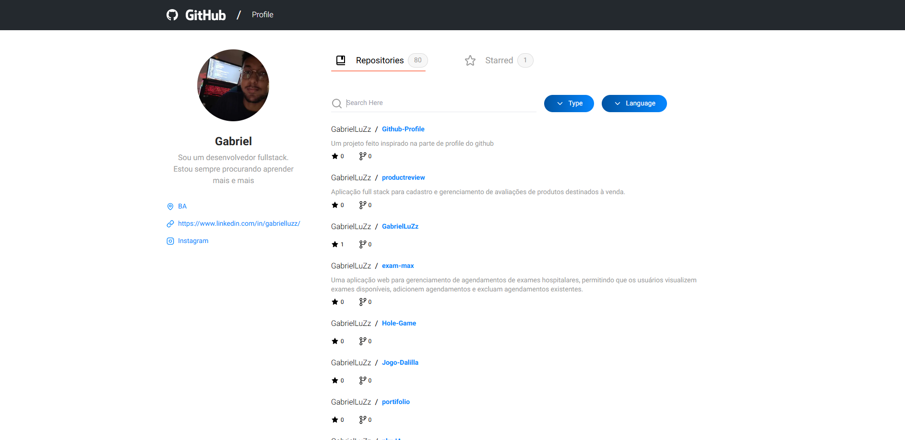

# GitHub Profile Explorer

Uma aplicação web moderna construída com Next.js 14 que permite explorar perfis e repositórios do GitHub com uma interface elegante e responsiva.



## 🚀 Tecnologias Utilizadas

- [Next.js 14](https://nextjs.org/)
- [React 18](https://reactjs.org/)
- [TypeScript](https://www.typescriptlang.org/)
- [TailwindCSS](https://tailwindcss.com/)
- [Zustand](https://zustand-demo.pmnd.rs/) (Gerenciamento de Estado)
- [React Query](https://tanstack.com/query/latest) (Gerenciamento de Cache e Requisições)
- [Radix UI](https://www.radix-ui.com/) (Componentes Acessíveis)
- [Motion](https://motion.dev/) (Animações)

## 📋 Pré-requisitos

- Node.js 18.x ou superior
- npm ou yarn
- Git

## 🔧 Instalação

1. Clone o repositório:
```bash
git clone <seu-repositorio>
cd <nome-da-pasta>
```

2. Instale as dependências:
```bash
npm install
# ou
yarn install
```

3. (Opcional) Para evitar limites de requisições da API do GitHub, você pode criar um arquivo `.env.local` na raiz do projeto e adicionar:
```bash
GITHUB_TOKEN=seu_token_pessoal_do_github
```
Se não configurar o token, a aplicação funcionará normalmente, mas estará sujeita ao rate limit público da API do GitHub.

4. Inicie o servidor de desenvolvimento:
```bash
npm run dev
# ou
yarn dev
```

5. Acesse a aplicação em `http://localhost:3000`

## ⚙️ Configurações Adicionais

Para personalizar a aplicação, você pode ajustar as seguintes constantes no arquivo `utils.ts`:
- `ITEMS_PER_PAGE`: Altera o número de itens exibidos por página
- `GITHUB_USERNAME`: Define o usuário do GitHub cujas informações serão exibidas por padrão

## 🛠️ Desafios Encontrados

- **Performance e Otimização**
  - Desafio: Lidar com grandes listas de repositórios e paginação
  - Solução: Implementação de paginação no lado do servidor e virtualização de listas

- **Responsividade e UX**
  - Desafio: Garantir a responsividade dos filtros
  - Solução: Uso de TailwindCSS, design system adaptativo e componentes de filtro responsivos

- **Rate Limiting da API do GitHub**
  - Desafio: Lidar com limites de requisição da API
  - Solução: Implementação de autenticação com token e cache eficiente

## 🚀 Possíveis Melhorias

### Performance
1. Implementar SSG (Static Site Generation) para páginas de perfil populares
2. Implementar PWA (Progressive Web App)

### Estrutura
1. Adicionar testes unitários e de integração
2. Implementar Storybook para documentação de componentes
3. Melhorar a organização de tipos TypeScript

### Funcionalidades
1. Adicionar mais filtros de busca
2. Adicionar autenticação OAuth com GitHub

### UX/UI
1. Adicionar mais temas (dark/light)
2. Adicionar mais animações de transição
3. Melhorar acessibilidade (WCAG)

## 📝 Licença

Este projeto está sob a licença MIT. Veja o arquivo [LICENSE](LICENSE) para mais detalhes.

## 👥 Autores

* **Gabriel Luz** - *Trabalho Inicial* - [GabrielLuZz](https://github.com/GabrielLuZz)